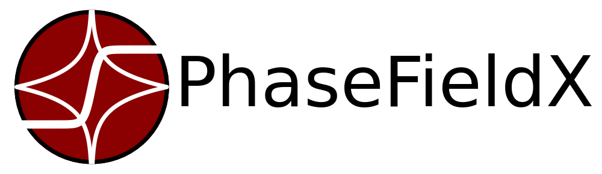

.. raw:: html

    

.. raw:: html

    

        <h1 style="color: var(--pst-color-primary); margin-bottom: 20px;">
            A Correction Method for Crack Area Overestimation in Phase-Field Fracture
        </h1>

        
    

.. This repository provides all simulation files, scripts, and supplementary data referenced in the paper :footcite:t:`phase_field_crack_area_overestimation_Castillon2025`.

Phase-field fracture models are known to overestimate crack area, a discrepancy that compromises the accuracy of fracture predictions. This issue stems from the diffuse crack representation and numerical artifacts, such as strain localization, where the phase-field variable artificially saturates across finite elements.

Existing correction strategies, including mesh-dependent factors and skeletonization algorithms, have significant limitations. Mesh-based corrections are often unreliable for unstructured meshes, while skeletonization can be complex and inaccurate for intricate crack topologies, especially in three dimensions.

This paper introduces a novel and robust framework to correct this overestimation. Our approach is founded on an energy equipartition result observed in the one-dimensional analytical solution of the phase-field model. In this case, the energy contributions from the phase-field and its gradient are equal when the length scale parameter goes to zero. Since numerical artifacts primarily affect the phase-field term while leaving its gradient largely unperturbed, we propose that the crack area can be accurately approximated as twice the gradient-dependent energy. This method is inherently mesh-independent and readily applicable to the entire domain, including 3D simulations.

The proposed methodology is validated against benchmarks with analytical solutions and compared with established methods like skeletonization to demonstrate its accuracy. It is then applied to complex geometries with curvilinear crack paths and evaluated in a three-dimensional simulation.

.. highlights::

    - **Novel Correction Method**: Introduces a new method to correct the overestimation of crack area in phase-field fracture simulations, a common issue that affects the accuracy of physical quantities.
    - **Energy Equipartition Principle**: The correction is based on the analytical observation that energy from the phase-field and its gradient are equal. It approximates the crack area as twice the gradient-dependent energy, which is unaffected by numerical artifacts.
    - **Mesh-Independent and 3D-Ready**: The proposed method is inherently mesh-independent and easily applicable to 3D simulations, avoiding the complexity of alternative techniques like skeletonization.
    - **Improved Physical Predictions**: Effectively mitigates the non-physical peak force artifact in force-displacement curves, leading to more accurate and conservative load predictions that converge with mesh refinement.
    - **Robust and Versatile**: The method shows less sensitivity to mesh resolution compared to other corrections and is adaptable to various phase-field models (e.g., AT1 and AT2).
    - **Computationally Efficient**: The correction adds no significant computational cost, as it relies on energy quantities already computed during the simulation.

    This repository is designed to ensure complete reproducibility of the results by providing all simulation data, parameter sets, meshes, and detailed numerical configurations.

.. code:: latex

    @misc{castillon2025,
        title={A Post-Processing Correction Method for Crack Area Overestimation in Phase-Field Fracture}, 
        author={M. Castillón and I. Romero and J. Segurado},
        year={},
        eprint={},
        archivePrefix={arXiv},
        primaryClass={},
        url={}, 
    }

All the files are provided in the following `GitHub Repository <https://github.com/CastillonMiguel/A-Phase-Field-Approach-to-Fracture-and-Fatigue-Analysis-Bridging-Theory-and-Simulation>`_

Since the simulations were conducted using the open-source **PhaseFieldX** :footcite:t:`code_phasefieldx` library, the implementation details of the models can be found in the **PhaseFieldX** documentation and source code.

- GitHub Repository: `https://github.com/CastillonMiguel/phasefieldx <https://github.com/CastillonMiguel/phasefieldx>`_
- Documentation: `https://phasefieldx.readthedocs.io <https://phasefieldx.readthedocs.io>`_
- Paper: `https://doi.org/10.21105/joss.07307 <https://doi.org/10.21105/joss.07307>`_

The **PhaseFieldX** project is designed to simulate and analyze material behavior using phase-field models, which provide a continuous approximation of interfaces, phase boundaries, and discontinuities such as cracks. Leveraging the robust capabilities of *FEniCSx*, a renowned finite element framework for solving partial differential equations, this project facilitates efficient and precise numerical simulations. It supports a wide range of applications, including phase-field fracture, solidification, and other complex material phenomena, making it an invaluable resource for researchers and engineers in materials science.

.. footbibliography::

.. toctree::

   indications/index
   references/index.rst
   related/index.rst
